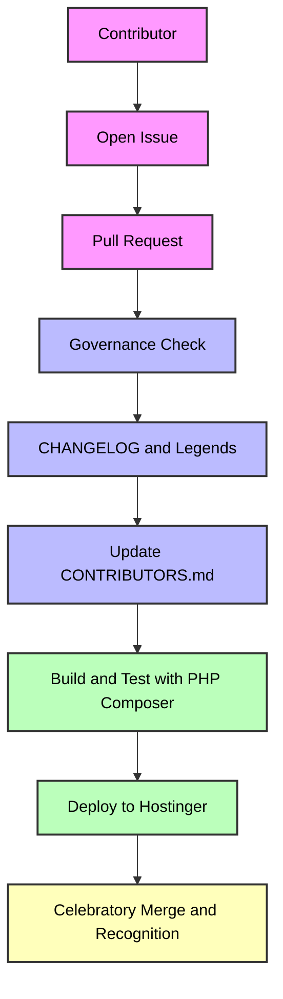
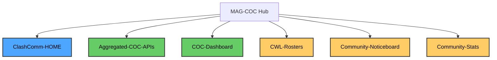
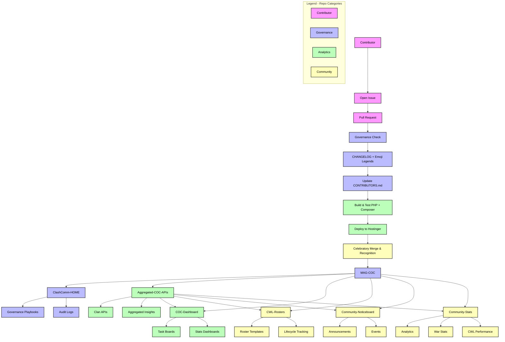

# Welcome to MAG-COC 🎉

MAG-COC is more than just a GitHub account — it’s a governance-ready ecosystem built for community, clarity, and celebration.  
Every repo here is designed to empower contributors, ritualize delivery, and make milestones memorable.

---

## 🌌 Our Mission
We believe open-source should feel like a journey, not just a codebase.  
That’s why MAG-COC combines technical rigor with playful rituals:
- 🛡 Governance artifacts ensure compliance and traceability.
- 🏅 Contributors are recognized and celebrated in every merge.
- 📜 Milestones are logged in comic-strip style for teachable storytelling.
- 🎉 Delivery is treated as a community celebration, not just a deployment.

---

## 🚀 What You’ll Find Here
- **ClashComm-HOME** → Governance playbooks and audit logs  
- **Aggregated-COC-APIs** → Unified APIs for clan insights  
- **COC-Dashboard** → Task boards and stats dashboards  
- **CWL-Rosters** → Roster templates and lifecycle tracking  
- **Community-Noticeboard** → Announcements and events  
- **Community-Stats** → Analytics, war stats, CWL performance  

---

## 🎉 Our Culture
Contributors don’t just commit code — they join a ritual.  
Every issue, pull request, and merge is part of a lifecycle that celebrates progress, empowers stakeholders, and future-proofs the platform.

---

## 🌌 Our Governance Philosophy
- 🛡 Contribution rules → Ritualized and teachable
- 🏅 Contributor recognition → Every name celebrated
- 📜 Milestone logs → Comic-strip style CHANGELOGs
- ⚖️ Legal clarity → Apache 2.0 LICENSE + NOTICE attribution

---

## 📊 Repo Ecosystem
- 🌌 **ClashComm-HOME** → Governance playbooks, audit logs  
- 🔗 **Aggregated-COC-APIs** → Unified APIs for clan insights  
- 📊 **COC-Dashboard** → Task boards and stats dashboards  
- 🏆 **CWL-Rosters** → Roster templates and lifecycle tracking  
- 📣 **Community-Noticeboard** → Announcements and events  
- 📊 **Community-Stats** → Analytics, war stats, CWL performance  

---

## 🎉 Our Governance Lifecycle
- Contributions are celebrated with emoji legends.  
- Milestones are logged in comic‑strip style.  
- Governance artifacts ensure compliance and traceability.

---

## Repo Ecosystem Diagram

---

## Lifecycle + Repo Ecosystem Diagram

---

## 🔹 Style Choices
- **Governance repos (blue)** → ClashComm‑HOME  
- **Analytics repos (green)** → APIs + Dashboard  
- **Community repos (gold)** → Rosters, Noticeboard, Stats  
- **Black text (`color:#000`)** → Ensures labels are always readable against bright fills.  
- **Dark stroke (`stroke:#333`)** → Keeps node outlines clear.  

---

## Emoji Legend Table
| Emoji | Meaning                  |
|-------|--------------------------|
| ✅    | Completed task           |
| 📊    | Stats update             |
| 🏆    | CWL milestone            |
| 📣    | Announcement             |
| 🛡    | Governance ritual        |
| 🎉    | Celebratory merge        |

---

## Governance Suite
- [CONTRIBUTORS.md](CONTRIBUTORS.md)
- [CHANGELOG.md](CHANGELOG.md)
- [LICENSE.md](LICENSE.md)
- [NOTICE](NOTICE)
