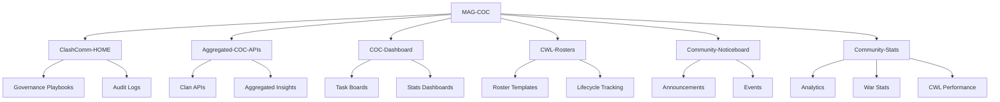

# MAG-COC 🎉

Welcome to the MAG-COC GitHub account!  
We build a governance-ready ecosystem for Clash of Clans communities, combining technical delivery with celebratory rituals.

---

## 🌌 Our Governance Philosophy
- 🛡 Contribution rules → Ritualized and teachable
- 🏅 Contributor recognition → Every name celebrated
- 📜 Milestone logs → Comic-strip style CHANGELOGs
- ⚖️ Legal clarity → Apache 2.0 LICENSE + NOTICE attribution

---

## 📊 Repo Ecosystem
- 🌌 **ClashComm-HOME** → Governance playbooks, audit logs  
- 🔗 **Aggregated-COC-APIs** → Unified APIs for clan insights  
- 📊 **COC-Dashboard** → Task boards and stats dashboards  
- 🏆 **CWL-Rosters** → Roster templates and lifecycle tracking  
- 📣 **Community-Noticeboard** → Announcements and events  
- 📊 **Community-Stats** → Analytics, war stats, CWL performance  

---

## 🎉 Our Governance Lifecycle
- Contributions are celebrated with emoji legends.  
- Milestones are logged in comic‑strip style.  
- Governance artifacts ensure compliance and traceability.

```mermaid
flowchart TD
    %% Governance Lifecycle
    A[Contributor] --> B[Open Issue]
    B --> C[Pull Request]
    C --> D[Governance Check]
    D --> E[CHANGELOG + Emoji Legends]
    E --> F[Update CONTRIBUTORS.md]
    F --> G[Build & Test (PHP + Composer)]
    G --> H[Deploy to Hostinger]
    H --> I[Celebratory Merge & Recognition]

    %% Repo Ecosystem
    I --> J[MAG-COC]
    J --> K[ClashComm-HOME]
    J --> L[Aggregated-COC-APIs]
    J --> M[COC-Dashboard]
    J --> N[CWL-Rosters ]
    J --> O[Community-Noticeboard 
    J --> P[Community-Stats]

    %% Sub-nodes for clarity
    K --> K1[Governance Playbooks]
    K --> K2[Audit Logs]

    L --> L1[Clan APIs]
    L --> L2[Aggregated Insights]

    M --> M1[Task Boards]
    M --> M2[Stats Dashboards]

    N --> N1[Roster Templates]
    N --> N2[Lifecycle Tracking]

    O --> O1[Announcements]
    O --> O2[Events]

    P --> P1[Analytics]
    P --> P2[War Stats]
    P --> P3[CWL Performance]
```
---

## Ecosystem
```mermaid
flowchart TD
    A[Contributor] --> B[Open Issue]
    B --> C[Pull Request]
    C --> D[Governance Check]
    D --> E[CHANGELOG + Emoji Legends]
    E --> F[Update CONTRIBUTORS.md]
    F --> G[Build & Test (PHP + Composer)]
    G --> H[Deploy to Hostinger]
    H --> I[Celebratory Merge & Recognition]
```
---


